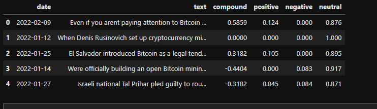
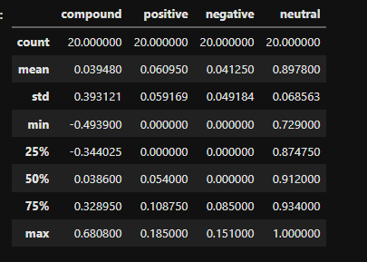
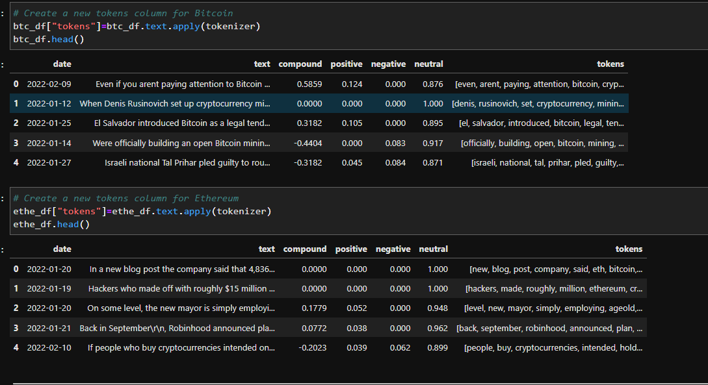
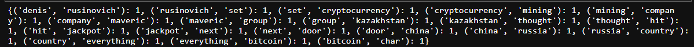
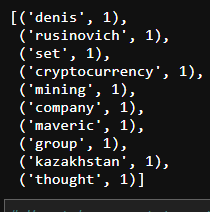
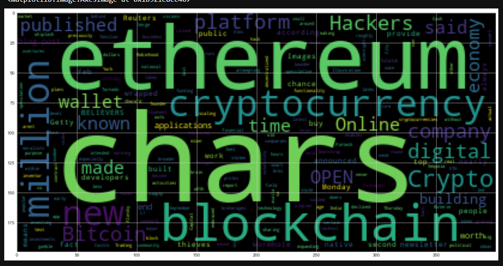
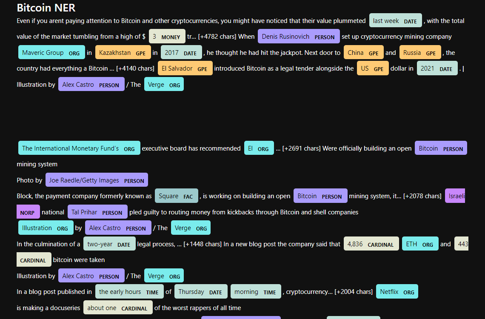
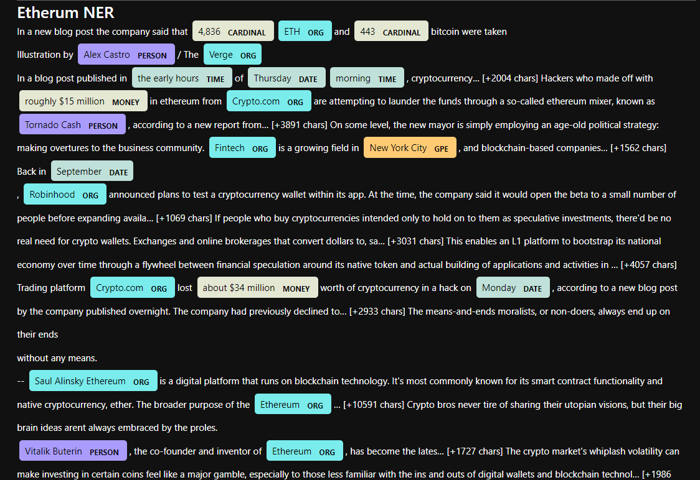

Stock Sentiment
### By Nedal Mahanweh

## INTRODUCTION
In this project we  will apply natural language processing to understand the sentiment in the latest news articles featuring Bitcoin and Ethereum. we will also apply fundamental NLP techniques to better understand the other factors involved with the coin prices such as common words and phrases and organizations and entities mentioned in the articles
____________________________________________________________________________________
## Files
[Crypto_Sentiment](Crypto_sentiment.ipynb)

[Resources](Resources)

____________________________________________________________________________________
##  Sentiment Analysis
_________________________________________________________________________________________
We will Use the newsapi to pull the latest news articles for Bitcoin and Ethereum and create a DataFrame of sentiment scores for each coin.

#####  The Bitcoin sentiment scores DataFrame

#####   Describe the Bitcoin Sentiment

### Obeservations 
after creating  the sentiment scores DataFram for both bitcoin and etherium  then applying the  ` describe() `methode , we were able to come to this conclusion 
* the Bitcoin have the highest mean positive score
* Ethereum and Bitcoin have the same  compound score
* Ethereum and Bitcoin have the same  positive score 

-------------------------------------------------------------------------------------------------
##     Natural Language Processing
-----------------------------------------------------------------------------------------------
## 1- Tokenizer
Using the ` def function ` was helpful to complete all the tokenizer process 

Creating  a new tokens column for Bitcoin and Ethereum and adding them to the original DataFrame 

____________________________________________________________________________________________
###  2- NGrams and Frequency Analysis
In this section we will look at the ngrams and word frequency for each coin.

Generate the `Bitcoin `  N-grams where N=2

Using  `token_count ` to get the top 10 words for ` Bitcoin ` 

## -Word Clouds
In this section, we will generate word clouds for each coin to summarize the news for each coin

##### Generate the Bitcoin word cloud
### The Bitcoin word cloud

### The Ethereum word cloud

______________________________________________________________________________________
### 3. Named Entity Recognition
In this section, you will build a named entity recognition model for both coins and visualize the tags using SpaCy

`` Bitcoin NER ``

### Ethereum NER

